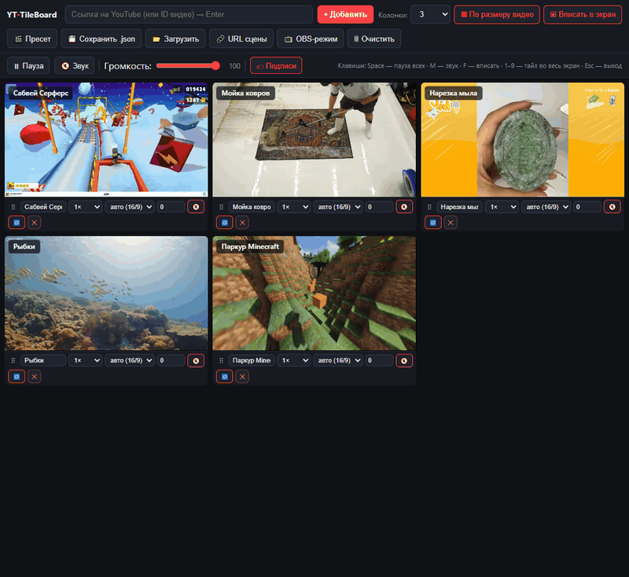
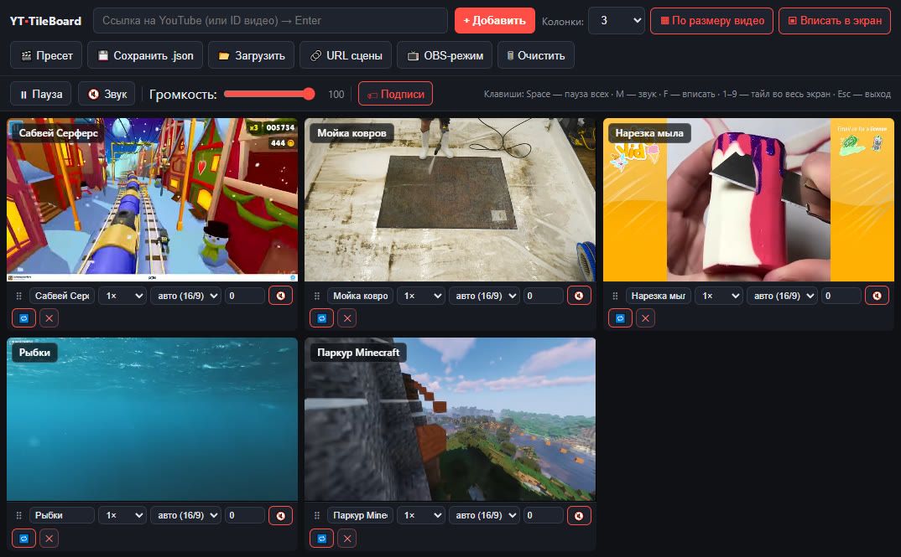
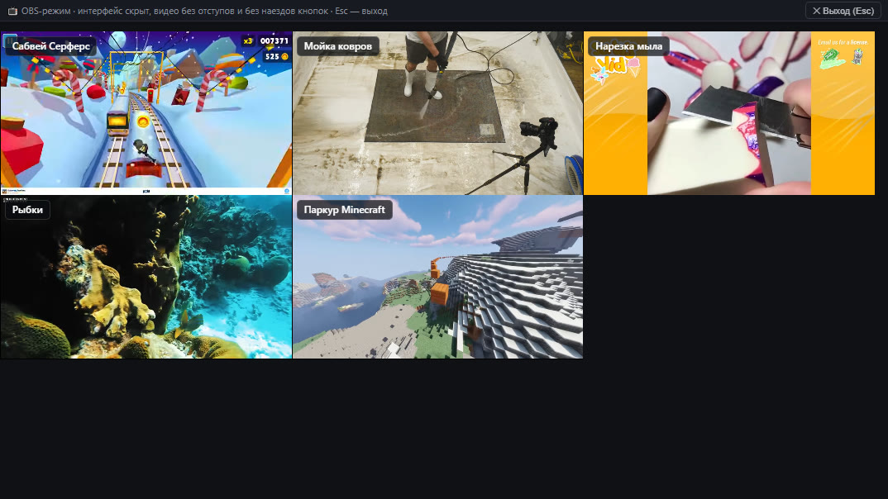
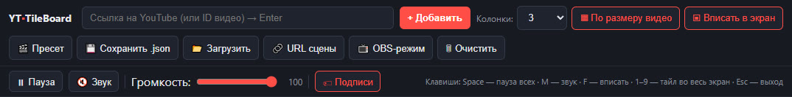
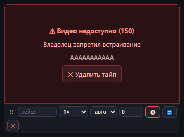

[English](README.md) | **Русский**

# YT Tile Board 🎬

**Мульти-видео YouTube-борд для OBS — один HTML-файл, ноль плагинов.**

Вставь кучу YouTube-ссылок, разложи их сеткой, нажми **OBS-режим** — и получишь сцену, где до 16 видео играют рядом (в пресете — 5): без чёрных полей, без кадрирования и без десятка отдельных Browser Source'ов.




> **▶️ Готовая ссылка:** [`neogara.github.io/YT-Tile-Board`](https://neogara.github.io/YT-Tile-Board/) — вставь её в OBS как Browser Source; локально ничего устанавливать и запускать не нужно.

## В чём прикол

- **Один файл вместо N Browser Source'ов** — `index.html` и есть продукт: HTML + CSS + JS внутри, без сборки и зависимостей.
- **Сцена = URL** — вся раскладка зашита в хэш ссылки. Копируешь *URL сцены*, вставляешь в OBS — готово.
- **Хостинг на GitHub Pages** — без `start.bat` и локального сервера: открой ссылку — и работает.
- **Без чёрных полей** — пропорции видео определяются автоматически, каждый тайл обнимает своё содержимое.
- **Перестановка без перезагрузки** — таскай тайлы за грип `⠿`, видео продолжают играть (меняется только flex-порядок).
- **Ошибки не превращаются в чёрный экран** — запрет встраивания показывает читаемую плашку (код → причина → удалить).
- **Пресет из коробки** — при первом запуске грузится готовый сладж-борд из `preset.json`.

## Быстрый старт

**🚀 Хостинг GitHub Pages (без установки):**

1. В OBS: **Источники → + → Browser**
   - URL: `https://neogara.github.io/YT-Tile-Board/`
   - Размер: **1920 × 1080**
   - ☑ *Refresh browser when scene becomes active*
2. Готово — встроенный пресет из 5 видео загрузится при первом открытии. Сервер вообще не нужен.

**🔧 Локальный запуск (разработка / доработки):**

1. Возьми `index.html` и `preset.json` (держи их в одной папке).
2. Запусти **`start.bat`** (или `node server.js`) → откроется `http://localhost:8000`.
   > YouTube блокирует эмбеды и автоплей на `file://` (ошибка 153) — открывай доску через любой HTTP-сервер; `server.js` — такой же, без зависимостей.
3. Укажи в OBS `http://localhost:8000/index.html` (как выше).

В любом случае жми **📺 OBS-режим** — интерфейс исчезает, видео заполняют сцену.

## Скриншоты

| Редактор | OBS-режим |
|:--:|:--:|
|  |  |

**Панель управления** — пауза/звук всего, громкость, подписи:



**Плашка ошибки** вместо чёрного тайла:



## Управление

### Горячие клавиши

| Клавиша | Действие |
|---|---|
| `Space` | пауза / пуск **всех** видео |
| `M` | выключить / включить звук у всех (работает и в русской раскладке) |
| `F` | вписать весь борд в экран (без скролла) |
| `1`–`9` | тайл №N во весь экран |
| `Esc` | закрыть полноэкранный тайл / выйти из OBS-режима |

В полях ввода клавиши игнорируются. В OBS работают через окно **Interact** у источника (ПКМ по источнику → *Interact*).

### Панель управления

- **⏸ Пауза / ▶ Пуск** — ставит на паузу или запускает все видео разом
- **🔇 Звук / 🔊 Звук вкл** — глобальный мьют; при выключении каждый тайл возвращается к своему персональному mute
- **Громкость** — общая громкость 0–100 для всех плееров
- **🏷 Подписи** — бейджи с названиями поверх видео (видны и в OBS-режиме)

Состояние панели едет вместе со сценой (`allPaused`, `masterMuted`, `volume`, `labels`).

## Работа со сценой

- **Добавление** — вставь ссылку или 11-символьный ID → `Enter`. Вставь сразу **список** (через пробел, перенос строки, запятую или точку с запятой) — добавятся все: дубли отсекаются, лимит 16.
- **Порядок** — перетаскивай тайлы за грип `⠿` на полоске под видео.
- **Полоска под каждым видео**: лейбл (становится бейджем), скорость (`0.25×`–`2×`), формат (`авто` — автоопределение, `16/9`, `9/16`, `4/3`, `1/1`, `21/9`), старт со смещения (сек), звук, луп, удаление.
- **Раскладка** — колонки `1`–`4` или `auto` (подбор по ширине окна), **По размеру видео** (тайлы под пропорции → без полей) или растянуть, **Вписать в экран** (замасштабировать всё без скролла).
- **Сохранение и шаринг**
  - **💾 Сохранить .json** / **📂 Загрузить** — файлы сцены;
  - **перетащи `.json` прямо на страницу** — загрузится;
  - **🔗 URL сцены** — одна ссылка со всей сценой в хэше (лучший вариант для OBS);
  - **🎬 Пресет** — перезагрузить встроенный борд из 5 видео.
- Всё автосохраняется в `localStorage` — при следующем открытии вернётся последняя сцена (хэш-URL имеет приоритет).
- **🗑 Очистить** — очистить весь борд (с подтверждением).

## Настройки OBS

- Используй **1920×1080** — борд масштабируется, но раскладка заточена под 16:9.
- Хостинг-ссылке сервер не нужен вообще; для локального URL держи `server.js` запущенным (добавь `start.bat` в автозагрузку).
- **📺 OBS-режим** прячет редактор; тонкая полоска сверху (подсказка + `✕ Выход`) остаётся **над** сеткой и никогда не наезжает на видео.
- Автоплей идёт **без звука** (политика браузера). Включи звук кнопкой **🔊** — CEF в OBS это уважает.
- `Refresh browser when scene becomes active` пересинхронит всё при переключении сцен.

## Если что-то не так

| Симптом | Решение |
|---|---|
| Чёрные тайлы, **ошибка 153** в консоли | Открыл через `file://` — используй ссылку хостинга или запусти `start.bat` |
| Плашка *Видео недоступно (2 / 5 / 100 / 101 / 150)* | Неверный ID (2), плеер не может его проиграть (5), видео удалено (100) или встраивание запрещено (101/150) — поменяй ссылку, на плашке есть кнопка удаления |
| Неправильные пропорции | Автоопределение может упасть (CORS) и откатиться на 16:9 — выбери формат вручную в полоске тайла |
| Сцена «забылась» | Состояние лежит в `localStorage`; хэш-URL его перебивает — проверь адресную строку |
| Нет звука | По дизайну всё стартует без звука — жми **🔊 Звук** и проверь ползунок громкости |

## Структура проекта

```
index.html      всё приложение (HTML + CSS + JS внутри)
preset.json     встроенный пресет из 5 видео
server.js       dev-сервер без зависимостей (его оборачивает start.bat)
docs/           скриншоты и demo.gif для этого README
tests/          регрессионные проверки: node tests/check.js && node tests/check2.js
```

## Лицензия

**Пока не выбрана.** Issues и PR приветствуются.
